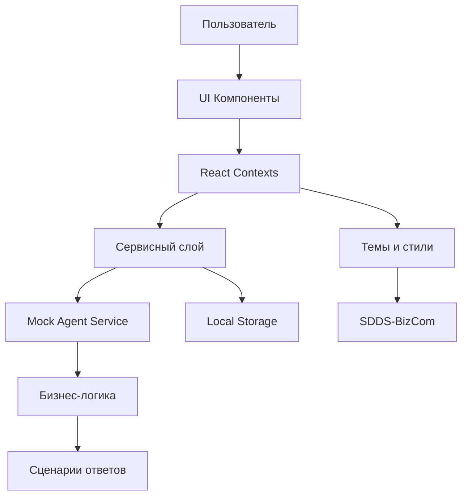

# BCP AI Chat - Полноэкранный чат-интерфейс с AI-агентом


## 📋 Оглавление

- [Обзор проекта](#обзор-проекта)
- [🚀 Быстрый старт](#-быстрый-старт)
- [✨ Функциональные возможности](#-функциональные-возможности)
- [🏗️ Архитектура проекта](#️-архитектура-проекта)
- [💬 Типы сообщений AI-агента](#-типы-сообщений-ai-агента)
- [🎨 Система тем](#-система-тем)
- [🛠️ Разработка](#️-разработка)
- [📦 Деплоймент](#-деплоймент)
- [📚 Демонстрационный сценарий](#-демонстрационный-сценарий)
- [📄 Лицензия](#-лицензия)

## Обзор проекта

**BCP AI Chat** - это современное React-приложение, предоставляющее полноэкранный чат-интерфейс для взаимодействия с AI-агентом. Проект разработан с использованием TypeScript и следует лучшим практикам современной веб-разработки.

### 🎯 Основные цели

- Создание интуитивного и отзывчивого чат-интерфейса
- Реализация расширенных типов сообщений AI-агента
- Обеспечение типобезопасности через TypeScript
- Поддержка тем оформления и адаптивного дизайна
- Демонстрация возможностей через сценарий "Открытие кофейни"

## 🚀 Быстрый старт

### Предварительные требования

- Node.js 16+ 
- npm или yarn

### Установка и запуск

```bash
# Клонирование репозитория
git clone <repository-url>
cd bcp_ai_regime

# Установка зависимостей
npm install

# Запуск в режиме разработки
npm run dev

# Сборка для продакшена
npm run build

# Предпросмотр собранного приложения
npm run preview
```

### Доступные команды

| Команда | Описание |
|---------|----------|
| `npm run dev` | Запуск dev-сервера на `http://localhost:5173` |
| `npm run build` | Сборка приложения для продакшена |
| `npm run preview` | Предпросмотр собранного приложения |
| `npm run lint` | Проверка кода с ESLint |
| `npm run type-check` | Проверка TypeScript типов |

## ✨ Функциональные возможности

### Основные возможности

- **💬 Полноэкранный чат-интерфейс** - современный дизайн с плавными анимациями
- **🤖 AI-агент с расширенными типами сообщений** - 9 различных типов сообщений
- **🎨 Система тем** - переключение между фиолетовой и зеленой темами
- **📱 Адаптивный дизайн** - оптимизация для всех устройств
- **⚡ Быстрые ответы** - интерактивные кнопки для ускорения диалога
- **📊 Визуализация данных** - таблицы, прогресс-бары, изображения
- **🔗 Интеграция ресурсов** - галерея полезных ссылок

### Расширенные возможности

- **Контекстное переключение тем** - автоматическая смена темы в зависимости от контекста диалога
- **Цепочка рассуждений** - отображение логики AI-агента в коллапсируемых блоках
- **Интерактивные формы** - сбор данных пользователя прямо в чате
- **Прогресс-отслеживание** - визуализация этапов анализа
- **Обработка ошибок** - устойчивость к сетевым проблемам

## 🏗️ Архитектура проекта

### Технологический стек

| Технология | Версия | Назначение |
|------------|--------|------------|
| React | 18.2.0 | UI библиотека |
| TypeScript | 5.0+ | Типобезопасность |
| Vite | 4.4.0 | Сборка и dev-сервер |
| Context API | Встроен | Управление состоянием |
| SDDS-BizCom | Локальная | Дизайн-система |

### Особенности дизайн-системы

**SDDS-BizCom** (Salute Design System for Business Communications) используется в проекте в локальной версии, расположенной в папке `.cache/plasma-dev/`. Это позволяет использовать все преимущества дизайн-системы без необходимости установки через npm registry.

**Ключевые особенности интеграции:**
- Использование компонентов из `.cache/plasma-dev/packages/sdds-bizcom/`
- Импорт стилей из `.cache/plasma-dev/packages/themes/plasma-themes/`
- Совместимость с существующей системой тем приложения
- Поддержка бизнес-режима через SDDS классы

### Структура проекта

```
src/
├── components/          # UI компоненты
│   ├── chat/           # Компоненты чат-интерфейса
│   ├── layout/         # Компоненты макета
│   └── theme/          # Компоненты темы
├── contexts/           # React контексты
│   ├── ChatContext.tsx # Управление чатом
│   ├── ThemeContext.tsx # Управление темами
│   └── AgentContext.tsx # Управление агентом
├── hooks/              # Кастомные хуки
│   ├── useChat.ts      # Логика чата
│   ├── useTheme.ts     # Логика тем
│   └── useAgent.ts     # Логика агента
├── services/           # Сервисный слой
│   └── agent/          # Сервисы AI-агента
├── types/              # TypeScript типы
├── utils/              # Вспомогательные функции
├── constants/          # Константы приложения
├── styles/             # Стили и темы
└── demo/               # Демонстрационные сценарии
```

### Архитектурная диаграмма



### Ключевые архитектурные решения

1. **Context API вместо Redux** - оптимально для приложения среднего размера
2. **Модульная структура** - четкое разделение ответственности
3. **Типобезопасность** - полное покрытие TypeScript
4. **Сервис-ориентированная архитектура** - легкая замена mock-агента

## 💬 Типы сообщений AI-агента

Проект поддерживает 9 расширенных типов сообщений для создания богатого пользовательского опыта:

### 1. 📝 Текстовые сообщения (`Text`)
- Основной тип сообщений с поддержкой форматирования
- Поддержка plain text и markdown
- Автоматическое определение ссылок и email

```typescript
interface TextMessage {
  type: 'text';
  content: string;
  format?: 'plain' | 'markdown';
}
```

### 2. 🔍 Коллапсируемые рассуждения (`Collapsible`)
- Отображение цепочки рассуждений AI-агента
- Возможность свернуть/развернуть детали
- Визуализация логики принятия решений

### 3. 📋 Формы сбора данных (`Form`)
- Интерактивные формы прямо в чате
- Валидация данных на клиенте
- Автоматическое сохранение контекста

### 4. 🖼️ Изображения (`Image`)
- Визуализация данных и концепций
- Поддержка различных форматов
- Адаптивная подгрузка

### 5. 🔗 Галерея ссылок (`Links`)
- Структурированный список полезных ресурсов
- Группировка по категориям
- Быстрый доступ к дополнительным материалам

### 6. 📊 Таблицы данных (`Table`)
- Структурированное представление данных
- Финансовые расчеты и аналитика
- Сортировка и фильтрация

### 7. 📈 Прогресс-бары (`Progress`)
- Визуализация этапов анализа
- Процент выполнения задач
- Статус обработки запросов

### 8. 🎯 Группы кнопок (`Button Group`)
- Интерактивные действия пользователя
- Быстрая навигация по сценарию
- Контекстно-зависимые опции

### 9. ⚡ Быстрые ответы (`Quick Replies`)
- Предопределенные варианты ответов
- Ускорение диалога
- Подсказки для пользователя

## 🎨 Система тем

### Доступные темы

#### Фиолетовая тема (`purple`)
- **Основной цвет**: `#8B5CF6`
- **Фон**: `#1E1B2E`
- **Поверхность**: `#2D2A42`
- **Идеально для**: технических консультаций

#### Зеленая тема (`green`) 
- **Основной цвет**: `#10B981`
- **Фон**: `#0F172A`
- **Поверхность**: `#1E293B`
- **Идеально для**: бизнес-консультаций

### Автоматическое переключение тем

Система автоматически переключает темы в зависимости от контекста диалога:

- **Фиолетовая тема** - по умолчанию, для общего взаимодействия
- **Зеленая тема** - активируется при выборе бизнес-режима (ММБ/КБ)

### Реализация темы

```typescript
// constants/themes.ts
export const PURPLE_THEME: Theme = {
  name: 'purple',
  colors: {
    primary: '#8B5CF6',
    secondary: '#A78BFA',
    background: '#1E1B2E',
    surface: '#2D2A42',
    text: {
      primary: '#F8FAFC',
      secondary: '#CBD5E1',
      disabled: '#64748B'
    }
  }
};
```

## 🛠️ Разработка

### Настройка окружения

```bash
# Установка зависимостей
npm install

# Запуск в режиме разработки
npm run dev

# Проверка типов TypeScript
npm run type-check

# Линтинг кода
npm run lint
```

### Структура компонентов

#### Основные компоненты чата

- **`ChatContainer`** - корневой контейнер чата
- **`MessageList`** - список сообщений с виртуализацией
- **`MessageInput`** - компонент ввода сообщений
- **`AgentMessage`** - отображение сообщений агента
- **`UserMessage`** - отображение сообщений пользователя

#### Специализированные компоненты сообщений

- **`TextMessageBubble`** - текстовые сообщения
- **`CollapsibleReasoning`** - цепочка рассуждений
- **`FormMessage`** - интерактивные формы
- **`TableMessage`** - таблицы данных
- **`ProgressMessage`** - прогресс-бары
- **`LinksGallery`** - галерея ссылок

### Кастомные хуки

```typescript
// useChat.ts - управление состоянием чата
const { messages, sendMessage, isLoading } = useChat();

// useTheme.ts - управление темами
const { theme, toggleTheme } = useTheme();

// useAgent.ts - взаимодействие с AI-агентом
const { sendMessageToAgent, isAgentTyping } = useAgent();
```

### Добавление нового типа сообщений

1. **Определить тип в TypeScript**:
```typescript
// src/types/chat.ts
export interface CustomMessage extends BaseMessage {
  type: 'custom';
  customData: any;
}
```

2. **Создать компонент**:
```typescript
// src/components/chat/CustomMessage.tsx
export const CustomMessage: React.FC<MessageComponentProps<CustomMessage>> = ({
  message,
  theme
}) => {
  return <div>Кастомное сообщение</div>;
};
```

3. **Зарегистрировать в системе**:
```typescript
// src/components/chat/index.ts
export const MessageComponents = {
  ...existingComponents,
  custom: CustomMessage
};
```

## 📦 Деплоймент

### Сборка для продакшена

```bash
npm run build
```

Собранное приложение будет доступно в папке `dist/`.

### Деплоймент на различные платформы

#### Netlify
```bash
# Установка Netlify CLI
npm install -g netlify-cli

# Деплоймент
netlify deploy --prod --dir=dist
```

#### Vercel
```bash
# Установка Vercel CLI
npm install -g vercel

# Деплоймент
vercel --prod
```

#### Статический хостинг
Просто загрузите содержимое папки `dist/` на любой статический хостинг.

### Переменные окружения

Создайте файл `.env` для настройки окружения:

```env
# Базовый URL API (для будущей интеграции)
VITE_API_BASE_URL=https://api.example.com

# Настройки агента
VITE_AGENT_RESPONSE_DELAY=300
VITE_AGENT_TYPING_DURATION=1500
VITE_AGENT_ERROR_RATE=0.05
```

## 📚 Демонстрационный сценарий

### "Открытие кофейни"

Полнофункциональный демонстрационный сценарий, показывающий все возможности AI-агента.

#### Последовательность взаимодействия

1. **Начало диалога**
   - Пользователь: "Хочу открыть кофейню"
   - Агент: Приветствие + выбор режима (ММБ/КБ)

2. **Выбор режима консультации**
   - **ММБ** (Модель малого бизнеса) - проекты до 5 млн рублей
   - **КБ** (Консалтинг бизнеса) - масштабные проекты
   - Автоматическая смена темы на зеленую

3. **Сбор данных о локации**
   - Форма для сбора информации:
     - Город/район
     - Тип локации
     - Конкуренция в районе

4. **Финансовый анализ**
   - Таблица с расчетами:
     - Стартовые инвестиции
     - Ежемесячные расходы
     - Прогноз выручки
     - Срок окупаемости

5. **Визуализация планировки**
   - Изображение с примером планировки
   - Оптимальная расстановка оборудования

6. **Полезные ресурсы**
   - Галерея ссылок на материалы:
     - Бизнес-план
     - Руководство по оборудованию
     - Маркетинговые стратегии

#### Тестовые команды

```bash
# Запуск демо-сценария
npm run dev

# Тестовые фразы в чате:
1. "Хочу открыть кофейню" - начало сценария
2. "ММБ" или "КБ" - выбор режима  
3. "локация" - форма сбора данных
4. "бюджет" - финансовый анализ
5. "план" - визуализация планировки
6. "ресурсы" - полезные ссылки
7. "прогресс" - статус анализа
8. "дальше" - быстрые ответы
```

### Скриншоты интерфейса

*(Здесь будут размещены скриншоты различных типов сообщений и тем)*

## 📄 Лицензия

Этот проект распространяется под лицензией MIT. Подробности см. в файле [LICENSE](LICENSE).

---

## 🤝 Вклад в проект

Мы приветствуем вклад в развитие проекта! Пожалуйста, ознакомьтесь с [руководством по вкладу](CONTRIBUTING.md) перед отправкой pull request.

## 🐛 Сообщение об ошибках

Если вы обнаружили ошибку, пожалуйста, создайте issue с подробным описанием проблемы и шагами для воспроизведения.

## 📞 Поддержка

По вопросам использования и разработки обращайтесь:
- Email: support@example.com
- Документация: [docs.example.com](https://docs.example.com)

---

**BCP AI Chat** - современное решение для создания интеллектуальных чат-интерфейсов с расширенными возможностями взаимодействия.