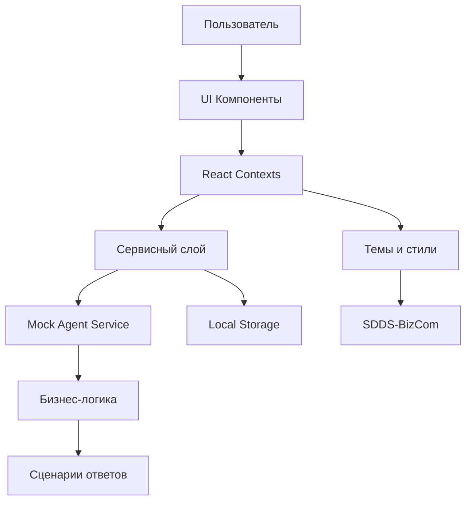
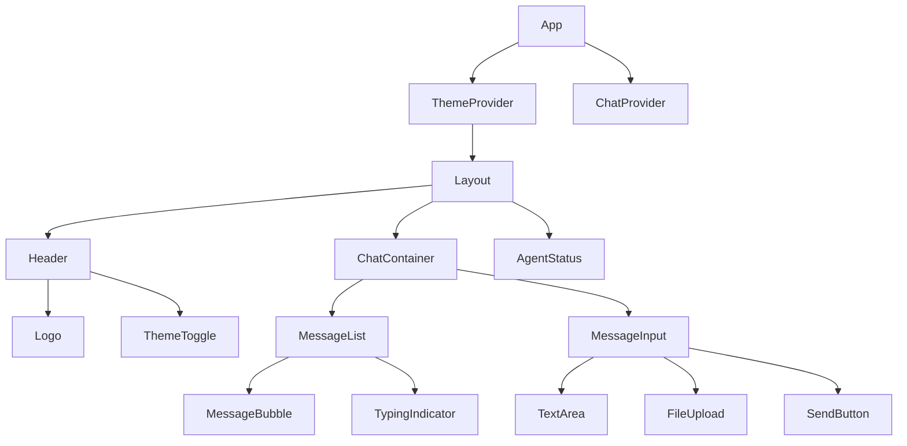
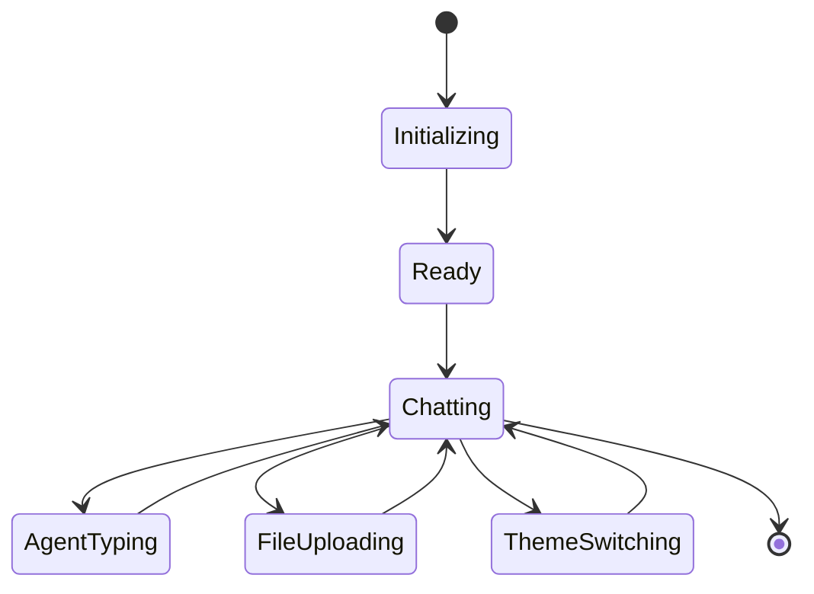

# Архитектура React-приложения полноэкранного чат-интерфейса с AI-агентом

## Содержание
1. [Общая архитектурная концепция](#общая-архитектурная-концепция)
2. [Файловая структура проекта](#файловая-структура-проекта)
3. [TypeScript интерфейсы](#typescript-интерфейсы)
4. [Компонентная иерархия](#компонентная-иерархия)
5. [Система стейт-менеджмента](#система-стейт-менеджмента)
6. [Архитектура mock-агента](#архитектура-mock-агента)
7. [Система тем и цветовых схем](#система-тем-и-цветовых-схем)
8. [Типы сообщений и их обработка](#типы-сообщений-и-их-обработка)
9. [Обоснование архитектурных решений](#обоснование-архитектурных-решений)
10. [Демонстрационный сценарий](#демонстрационный-сценарий)
11. [Диаграммы архитектуры](#диаграммы-архитектуры)

## Общая архитектурная концепция

### Технологический стек и обоснование
- **React 18+ с TypeScript** - современный, типобезопасный подход к разработке UI
- **SDDS-BizCom (@salutejs/plasma-bizcom)** - готовая дизайн-система для бизнес-приложений
- **Context API** - оптимальный выбор для управления состоянием в приложении среднего размера
- **Модульная архитектура** - разделение на независимые слои для масштабируемости

### Ключевые архитектурные принципы
1. **Принцип единой ответственности** - каждый компонент отвечает за одну конкретную задачу
2. **Инверсия зависимостей** - высокоуровневые модули не зависят от низкоуровневых
3. **Композиция над наследованием** - использование композиции компонентов для переиспользования кода
4. **Типобезопасность** - полное покрытие TypeScript для всех сущностей

## Файловая структура проекта

```
src/
├── components/                 # UI компоненты
│   ├── common/                # Общие компоненты
│   │   ├── Button/
│   │   ├── Input/
│   │   ├── Typography/
│   │   └── index.ts
│   ├── chat/                  # Компоненты чата
│   │   ├── ChatContainer/
│   │   ├── MessageList/
│   │   ├── MessageBubble/
│   │   ├── MessageInput/
│   │   ├── TypingIndicator/
│   │   └── index.ts
│   ├── layout/                # Компоненты макета
│   │   ├── Header/
│   │   ├── Sidebar/
│   │   └── index.ts
│   └── theme/                 # Компоненты темы
│       ├── ThemeToggle/
│       └── index.ts
├── contexts/                  # React контексты
│   ├── ChatContext.tsx
│   ├── ThemeContext.tsx
│   ├── AgentContext.tsx
│   └── index.ts
├── hooks/                     # Кастомные хуки
│   ├── useChat.ts
│   ├── useTheme.ts
│   ├── useAgent.ts
│   └── index.ts
├── services/                  # Сервисный слой
│   ├── agent/                 # Сервисы агента
│   │   ├── MockAgentService.ts
│   │   ├── types.ts
│   │   └── index.ts
│   ├── storage/               # Сервисы хранения
│   │   ├── LocalStorageService.ts
│   │   └── index.ts
│   └── api/                   # API сервисы (для будущей интеграции)
│       └── index.ts
├── types/                     # TypeScript типы
│   ├── chat.ts
│   ├── theme.ts
│   ├── agent.ts
│   ├── common.ts
│   └── index.ts
├── utils/                     # Вспомогательные функции
│   ├── formatters.ts
│   ├── validators.ts
│   └── index.ts
├── constants/                 # Константы приложения
│   ├── themes.ts
│   ├── messages.ts
│   └── index.ts
├── styles/                    # Стили и темы
│   ├── themes/
│   │   ├── purpleTheme.ts
│   │   ├── greenTheme.ts
│   │   └── index.ts
│   ├── globals.css
│   └── index.ts
└── App.tsx                    # Корневой компонент
```

### Обоснование файловой структуры

**components/** - организована по функциональным доменам для легкой навигации и переиспользования
**contexts/** - централизованное управление состоянием с четким разделением ответственности
**services/** - сервисный слой для бизнес-логики и внешних интеграций
**types/** - единый источник истины для TypeScript типов
**utils/** - утилитарные функции без побочных эффектов

## TypeScript интерфейсы

### Интерфейсы для сообщений чата

```typescript
// types/chat.ts

export interface BaseMessage {
  id: string;
  type: MessageType;
  timestamp: Date;
  sender: MessageSender;
  status: MessageStatus;
}

export interface TextMessage extends BaseMessage {
  type: 'text';
  content: string;
  format?: 'plain' | 'markdown';
}

export interface FileMessage extends BaseMessage {
  type: 'file';
  fileName: string;
  fileUrl: string;
  fileSize: number;
  mimeType: string;
}

export type Message = TextMessage | FileMessage;

export type MessageType = 'text' | 'file';
export type MessageSender = 'user' | 'agent';
export type MessageStatus = 'sending' | 'sent' | 'delivered' | 'read' | 'error';

export interface ChatSession {
  id: string;
  title: string;
  messages: Message[];
  createdAt: Date;
  updatedAt: Date;
  theme: ThemeType;
}
```

### Интерфейсы состояния приложения

```typescript
// types/common.ts

export interface AppState {
  currentSession: ChatSession | null;
  sessions: ChatSession[];
  isAgentTyping: boolean;
  currentTheme: ThemeType;
  agentMode: AgentMode;
}

export interface ChatState {
  messages: Message[];
  isLoading: boolean;
  error: string | null;
  isTyping: boolean;
}

export type ThemeType = 'purple' | 'green';
export type AgentMode = 'business-consultation' | 'technical-support';
```

### Интерфейсы темы оформления

```typescript
// types/theme.ts

export interface ThemeColors {
  primary: string;
  secondary: string;
  background: string;
  surface: string;
  text: {
    primary: string;
    secondary: string;
    disabled: string;
  };
  border: string;
  accent: string;
}

export interface Theme {
  name: ThemeType;
  colors: ThemeColors;
  typography: {
    fontFamily: string;
    fontSize: {
      small: string;
      medium: string;
      large: string;
    };
  };
  spacing: {
    xs: string;
    sm: string;
    md: string;
    lg: string;
    xl: string;
  };
}
```

### Интерфейсы компонентов агента

```typescript
// types/agent.ts

export interface AgentResponse {
  message: string;
  type: 'text' | 'suggestion' | 'question';
  actions?: AgentAction[];
  metadata?: Record<string, any>;
}

export interface AgentAction {
  type: 'button' | 'link' | 'form';
  label: string;
  payload: any;
}

export interface MockAgentConfig {
  responseDelay: number;
  typingDuration: number;
  errorRate: number;
}

export interface AgentService {
  sendMessage(message: string): Promise<AgentResponse>;
  startSession(theme: ThemeType): Promise<void>;
  endSession(): Promise<void>;
  isTyping(): boolean;
}
```

## Компонентная иерархия

### Структура компонентов

```
App
├── ThemeProvider
│   └── Layout
│       ├── Header
│       │   ├── Logo
│       │   └── ThemeToggle
│       ├── ChatContainer
│       │   ├── MessageList
│       │   │   ├── MessageBubble (Text)
│       │   │   ├── MessageBubble (File)
│       │   │   └── TypingIndicator
│       │   └── MessageInput
│       │       ├── TextArea
│       │       ├── FileUpload
│       │       └── SendButton
│       └── AgentStatus
└── ChatProvider
```

### Ответственности компонентов

**App** - корневой компонент, инициализация провайдеров
**ThemeProvider** - управление темами и цветовыми схемами
**Layout** - основной макет приложения
**Header** - заголовок с переключением тем
**ChatContainer** - контейнер чат-интерфейса
**MessageList** - список сообщений с виртуализацией
**MessageBubble** - отображение отдельных сообщений
**MessageInput** - компонент ввода сообщений
**AgentStatus** - индикатор статуса агента

## Система стейт-менеджмента

### Контексты и их ответственности

**ChatContext** - управление состоянием чата, сообщениями, сессиями
**ThemeContext** - управление темами, переключение цветовых схем
**AgentContext** - управление состоянием AI-агента, обработка ответов

### Кастомные хуки

```typescript
// hooks/useChat.ts
export const useChat = () => {
  const { state, dispatch } = useContext(ChatContext);
  
  const sendMessage = useCallback((content: string) => {
    // Логика отправки сообщения
  }, []);
  
  const uploadFile = useCallback((file: File) => {
    // Логика загрузки файла
  }, []);
  
  return {
    messages: state.messages,
    sendMessage,
    uploadFile,
    isLoading: state.isLoading,
    isTyping: state.isTyping
  };
};

// hooks/useTheme.ts
export const useTheme = () => {
  const { theme, setTheme } = useContext(ThemeContext);
  
  const toggleTheme = useCallback((newTheme: ThemeType) => {
    setTheme(newTheme);
  }, []);
  
  return {
    theme,
    toggleTheme,
    colors: theme.colors
  };
};
```

## Архитектура mock-агента

### Демонстрационный сценарий "Открытие бизнеса"

```typescript
// services/agent/MockAgentService.ts

export class MockAgentService implements AgentService {
  private currentScenario: BusinessScenario;
  private step: number = 0;
  
  constructor(private config: MockAgentConfig) {
    this.currentScenario = this.createBusinessScenario();
  }
  
  private createBusinessScenario(): BusinessScenario {
    return {
      steps: [
        {
          trigger: /.*бизнес.*открыть.*/i,
          response: "Отлично! Давайте вместе пройдем все этапы открытия бизнеса. Какую сферу деятельности вы рассматриваете?",
          actions: [
            { type: 'button', label: 'Розничная торговля', payload: 'retail' },
            { type: 'button', label: 'Услуги', payload: 'services' },
            { type: 'button', label: 'Производство', payload: 'production' }
          ]
        },
        {
          trigger: /.*розничн.*/i,
          response: "Прекрасный выбор! Розничная торговля требует тщательного планирования. Давайте начнем с выбора формата магазина:",
          actions: [
            { type: 'button', label: 'Интернет-магазин', payload: 'online' },
            { type: 'button', label: 'Офлайн магазин', payload: 'offline' },
            { type: 'button', label: 'Смешанный формат', payload: 'hybrid' }
          ]
        },
        // ... дополнительные шаги сценария
      ]
    };
  }
  
  async sendMessage(message: string): Promise<AgentResponse> {
    // Имитация задержки ответа
    await this.delay(this.config.responseDelay);
    
    // Поиск соответствующего шага в сценарии
    const step = this.findMatchingStep(message);
    
    if (step) {
      this.step++;
      return {
        message: step.response,
        type: 'text',
        actions: step.actions
      };
    }
    
    // Ответ по умолчанию
    return {
      message: "Я готов помочь вам с вопросами открытия бизнеса. Расскажите, на каком этапе вы находитесь?",
      type: 'text'
    };
  }
}
```

## Система тем и цветовых схем

### Реализация тем

```typescript
// constants/themes.ts

export const PURPLE_THEME: Theme = {
  name: 'purple',
  colors: {
    primary: '#8B5CF6',
    secondary: '#A78BFA',
    background: '#1E1B2E',
    surface: '#2D2A42',
    text: {
      primary: '#F8FAFC',
      secondary: '#CBD5E1',
      disabled: '#64748B'
    },
    border: '#4C4B63',
    accent: '#C4B5FD'
  },
  // ... остальные свойства темы
};

export const GREEN_THEME: Theme = {
  name: 'green',
  colors: {
    primary: '#10B981',
    secondary: '#34D399',
    background: '#0F172A',
    surface: '#1E293B',
    text: {
      primary: '#F1F5F9',
      secondary: '#CBD5E1',
      disabled: '#64748B'
    },
    border: '#334155',
    accent: '#6EE7B7'
  },
  // ... остальные свойства темы
};
```

### Механизм переключения тем

```typescript
// contexts/ThemeContext.tsx

export const ThemeContext = createContext<ThemeContextType>({} as ThemeContextType);

export const ThemeProvider: React.FC<{ children: ReactNode }> = ({ children }) => {
  const [currentTheme, setCurrentTheme] = useState<ThemeType>('purple');
  
  const theme = currentTheme === 'purple' ? PURPLE_THEME : GREEN_THEME;
  
  const toggleTheme = useCallback((newTheme: ThemeType) => {
    setCurrentTheme(newTheme);
    // Сохранение в localStorage для persistence
    localStorage.setItem('chat-theme', newTheme);
  }, []);
  
  const value = {
    theme,
    currentTheme,
    toggleTheme
  };
  
  return (
    <ThemeContext.Provider value={value}>
      {children}
    </ThemeContext.Provider>
  );
};
```

## Структура типов сообщений и их обработка

### Система типов сообщений

```typescript
// types/chat.ts

export type MessageComponentProps<T extends Message = Message> = {
  message: T;
  theme: Theme;
  onAction?: (action: AgentAction) => void;
};

// Компоненты для разных типов сообщений
export const MessageComponents: Record<MessageType, React.ComponentType<MessageComponentProps>> = {
  text: TextMessageComponent,
  file: FileMessageComponent
};
```

### Обработка и отображение сообщений

```typescript
// components/chat/MessageBubble.tsx

export const MessageBubble: React.FC<MessageComponentProps> = ({ message, theme, onAction }) => {
  const MessageComponent = MessageComponents[message.type];
  
  return (
    <div className={`message-bubble ${message.sender}`}>
      <MessageComponent 
        message={message} 
        theme={theme}
        onAction={onAction}
      />
      <MessageStatus status={message.status} />
      <MessageTimestamp timestamp={message.timestamp} />
    </div>
  );
};
```

## Обоснование архитектурных решений

### 1. Выбор Context API вместо Redux
- **Причина**: Приложение среднего размера с предсказуемым состоянием
- **Преимущества**: Меньше boilerplate кода, встроенная в React функциональность
- **Масштабируемость**: При необходимости можно мигрировать на Redux Toolkit

### 2. Модульная файловая структура
- **Причина**: Четкое разделение ответственности между слоями
- **Преимущества**: Легкая навигация, простое тестирование, переиспользование кода
- **Масштабируемость**: Возможность добавлять новые домены без изменения существующей структуры

### 3. Типобезопасная архитектура
- **Причина**: Предотвращение runtime ошибок, улучшение developer experience
- **Преимущества**: Автодополнение, рефакторинг, документация через типы
- **Масштабируемость**: Легкое добавление новых типов сообщений и функциональности

### 4. Сервис-ориентированная архитектура агента
- **Причина**: Разделение UI и бизнес-логики
- **Преимущества**: Легкая замена mock-агента на реальный AI-сервис
- **Масштабируемость**: Возможность добавления новых сценариев и интеграций

### 5. Система тем с контекстом
- **Причина**: Централизованное управление стилями и цветами
- **Преимущества**: Консистентный дизайн, легкое переключение тем
- **Масштабируемость**: Простое добавление новых цветовых схем

## Демонстрационный сценарий функционала

### Поток пользователя:
1. **Инициализация**: Пользователь открывает приложение, выбирает тему (фиолетовая/зеленая)
2. **Начало диалога**: Пользователь вводит сообщение о желании открыть бизнес
3. **Сценарий агента**: Mock-агент запускает пошаговый сценарий консультации
4. **Интерактивность**: Пользователь выбирает варианты через кнопки действий
5. **Загрузка файлов**: Пользователь загружает бизнес-план для анализа
6. **Смена темы**: Переключение между фиолетовой и зеленой темами в зависимости от контекста

### Ключевые пользовательские сценарии:
- **Сценарий 1**: Консультация по открытию бизнеса с пошаговым руководством
- **Сценарий 2**: Анализ загруженных документов и предоставление рекомендаций
- **Сценарий 3**: Переключение между режимами консультации с соответствующей сменой темы

## Диаграммы архитектуры

### Диаграмма потоков данных


### Диаграмма компонентной иерархии


### Диаграмма состояния приложения


## Заключение

Разработанная архитектура обеспечивает:

1. **Масштабируемость**: Модульная структура позволяет легко добавлять новые функции
2. **Поддержку TypeScript**: Полная типобезопасность для всех сущностей
3. **Гибкость темизации**: Легкое переключение между цветовыми схемами
4. **Интеграционную готовность**: Архитектура готова к подключению реальных AI-сервисов
5. **Производительность**: Оптимизированная структура компонентов и состояний

Архитектура соответствует современным best practices React-разработки и обеспечивает прочную основу для дальнейшего развития приложения.