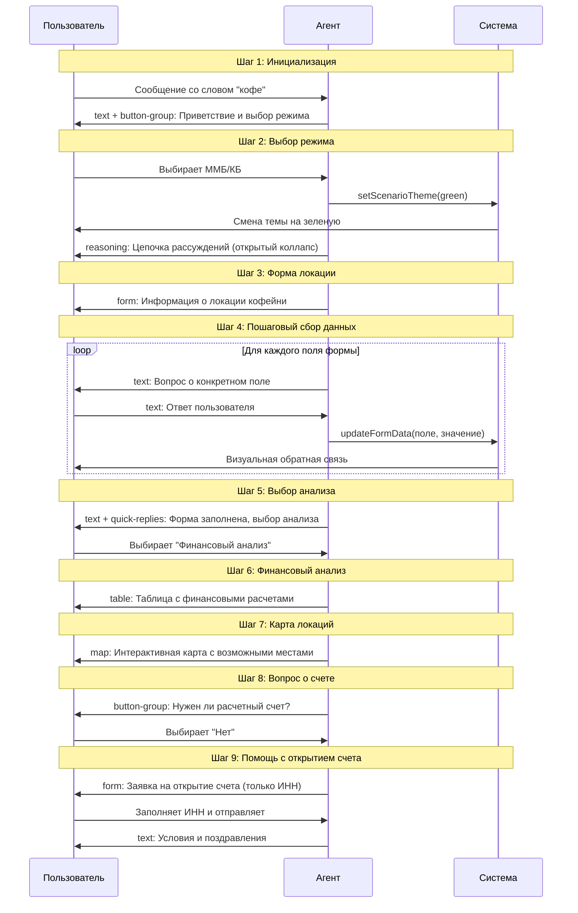
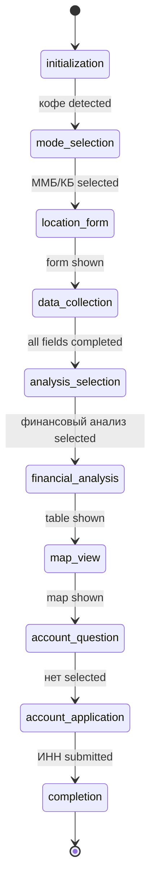
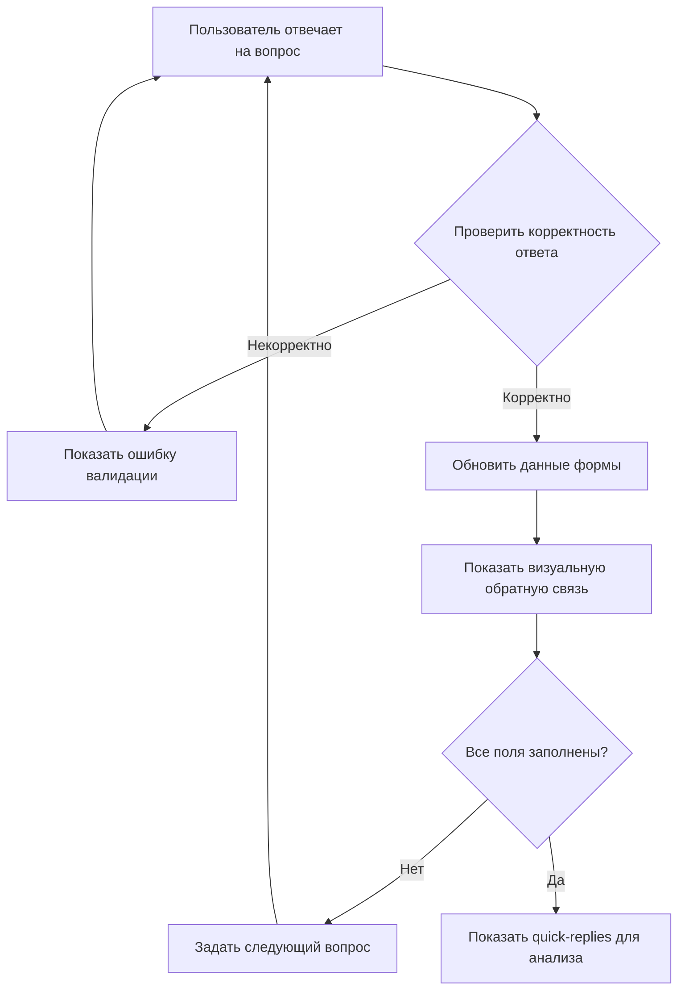

# Диаграмма последовательности нового сценария

## Mermaid Sequence Diagram



## Детальная структура данных состояния

### Интерфейс состояния сценария
```typescript
interface CoffeeShopScenarioState {
  // Текущий шаг сценария
  currentStep: ScenarioStep;
  
  // Данные пользователя
  userData: {
    // Шаг 2: Выбор режима
    businessMode?: 'mmb' | 'kb';
    
    // Шаг 3-4: Данные локации
    location?: {
      city: string;
      locationType: 'business' | 'mall' | 'street' | 'residential' | 'university';
      competition: string;
      coordinates?: { lat: number; lng: number };
    };
    
    // Шаг 6: Финансовый анализ
    financialAnalysis?: {
      initialInvestment: number;
      monthlyExpenses: number;
      projectedRevenue: number;
      netProfit: number;
      paybackPeriod: number;
    };
    
    // Шаг 9: Заявка на счет
    accountRequest?: {
      inn: string;
      submittedAt?: Date;
      status: 'pending' | 'submitted' | 'completed';
    };
  };
  
  // Прогресс заполнения форм
  formProgress: {
    location: {
      completed: boolean;
      fields: {
        city: boolean;
        locationType: boolean;
        competition: boolean;
      };
    };
    account: {
      completed: boolean;
      fields: {
        inn: boolean;
      };
    };
  };
  
  // Тема оформления
  theme: 'purple' | 'green';
  
  // История взаимодействий
  interactionHistory: InteractionEvent[];
}

type ScenarioStep = 
  | 'initialization'
  | 'mode_selection' 
  | 'location_form'
  | 'data_collection'
  | 'analysis_selection'
  | 'financial_analysis'
  | 'map_view'
  | 'account_question'
  | 'account_application'
  | 'completion';

interface InteractionEvent {
  type: 'message' | 'form_submit' | 'button_click' | 'quick_reply';
  timestamp: Date;
  data: any;
  step: ScenarioStep;
}
```

## Логика переходов между шагами

### State Machine Diagram



## Интеграция с существующими компонентами

### Карта соответствия компонентов

| Компонент | Файл | Используется в шагах |
|-----------|------|---------------------|
| `CollapsibleReasoning` | [`src/components/chat/CollapsibleReasoning.tsx`](src/components/chat/CollapsibleReasoning.tsx:1) | Шаг 2 |
| `FormMessage` | [`src/components/chat/FormMessage.tsx`](src/components/chat/FormMessage.tsx:1) | Шаг 3, 9 |
| `QuickReplies` | [`src/components/chat/QuickReplies.tsx`](src/components/chat/QuickReplies.tsx:1) | Шаг 5 |
| `TableMessage` | [`src/components/chat/TableMessage.tsx`](src/components/chat/TableMessage.tsx:1) | Шаг 6 |
| `MapMessage` | [`src/components/chat/MapMessage.tsx`](src/components/chat/MapMessage.tsx:1) | Шаг 7 |
| `ButtonGroup` | [`src/components/chat/ButtonGroup.tsx`](src/components/chat/ButtonGroup.tsx:1) | Шаг 1, 8 |

### Модификации в MockAgentService

```typescript
// В файле src/services/agent/MockAgentService.ts
private createBusinessScenario(): BusinessScenario {
  return {
    steps: [
      // Шаг 1: Инициализация
      {
        trigger: /.*кофе.*/i,
        response: "Отлично! Я готов помочь вам с открытием кофейни! 🎯\n\nДавайте выберем подходящий режим консультации:",
        actions: [
          { type: 'button', label: 'ММБ - Модель малого бизнеса', payload: 'mmb' },
          { type: 'button', label: 'КБ - Консалтинг бизнеса', payload: 'kb' }
        ]
      },
      // Шаг 2: Выбор режима + reasoning
      {
        trigger: /.*ммб.*|.*кб.*/i,
        response: "Отличный выбор! Давайте перейдем к детальному анализу вашего проекта.",
        messageType: 'reasoning',
        messageData: {
          steps: [
            { id: '1', content: 'Пользователь выбрал бизнес-режим консультации', timestamp: new Date() },
            { id: '2', content: 'Активируем бизнес-тему оформления', timestamp: new Date() },
            { id: '3', content: 'Начинаем сбор данных о локации кофейни', timestamp: new Date() }
          ],
          isCollapsed: false
        }
      },
      // Шаг 3: Форма локации (автоматически после reasoning)
      {
        trigger: /.*перейти.*локаци.*/i, // Внутренний триггер
        response: "Давайте соберем информацию о планируемой локации:",
        messageType: 'form',
        messageData: {
          title: 'Информация о локации кофейни',
          fields: [
            { id: 'city', type: 'text', label: 'Город', placeholder: 'В каком городе планируете открыть кофейню?', required: true },
            { id: 'locationType', type: 'select', label: 'Тип локации', options: [...], required: true },
            { id: 'competition', type: 'textarea', label: 'Конкуренция в районе', placeholder: 'Опишите конкурентов поблизости...' }
          ],
          submitLabel: 'Продолжить анализ'
        }
      },
      // ... остальные шаги
    ]
  }
}
```

## Обработка пользовательских действий

### Flow обработки пошаговых данных



### Логика автоматических переходов

```typescript
// В обработчике выбора режима
function handleModeSelection(mode: 'mmb' | 'kb') {
  // 1. Смена темы
  setScenarioTheme('green');
  
  // 2. Сохранение данных
  updateScenarioData({ businessMode: mode });
  
  // 3. Показ reasoning с задержкой
  setTimeout(() => {
    showReasoningMessage();
    
    // 4. Автоматический переход к форме через 2 секунды
    setTimeout(() => {
      triggerLocationForm();
    }, 2000);
  }, 500);
}

// В обработчике завершения формы
function handleFormCompletion(formData: any) {
  // 1. Сохранение данных
  updateScenarioData({ location: formData });
  
  // 2. Начало пошагового сбора
  startStepByStepDataCollection();
  
  // 3. После завершения всех шагов - показ анализа
  if (allStepsCompleted()) {
    showAnalysisOptions();
  }
}
```

## Технические требования к реализации

### Производительность
- Задержки между сообщениями: 200-500ms
- Длительность печатания: 1500ms
- Анимации: плавные переходы 300ms

### Доступность
- Поддержка клавиатурной навигации
- ARIA-атрибуты для всех интерактивных элементов
- Контрастные цвета для доступности

### Совместимость
- Поддержка всех современных браузеров
- Адаптивный дизайн для мобильных устройств
- Сохранение состояния при перезагрузке

Эта архитектура обеспечивает плавное и интуитивное взаимодействие пользователя с AI-агентом, полностью используя все доступные типы сообщений и интерактивные компоненты.